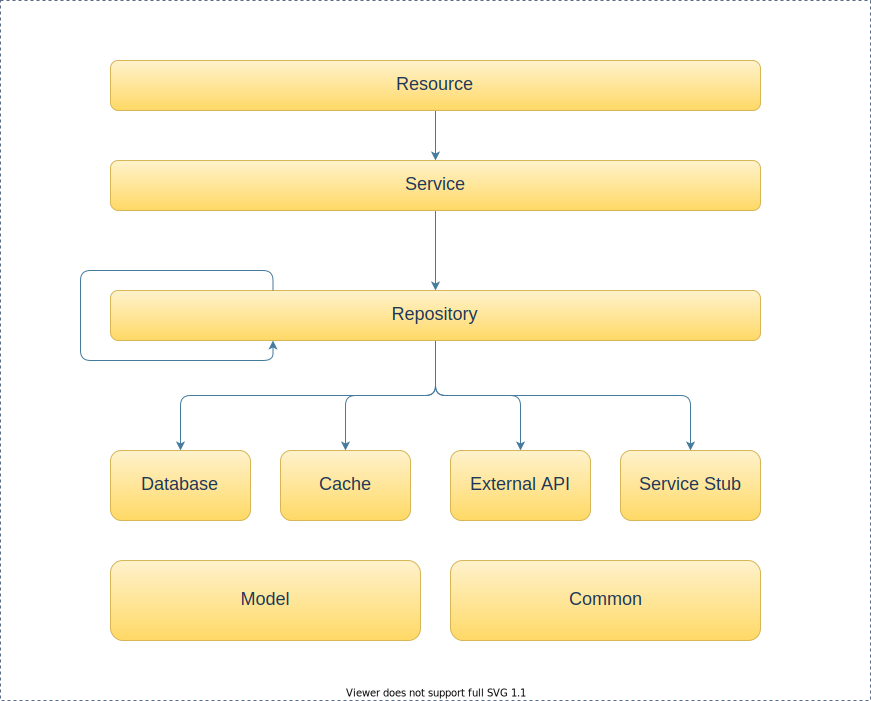

# 后端开发指南

## Merge 规则

绝不可直接 push 到 main 分支上！！

必须提交 PR 并有至少 1 人 review 没有问题以后方可 merge。

<br>

## branch 命名规则

- feature/aaa
- bugfix/bbb
- test/ccc
- cicd/ddd
- doc/eee
- other/fff

采用文件目录法命名 branch，这样就可以在 UI 界面里方便的查看所有的 branch 及其层级结构。

<br>

## git 配置

git 的配置是必须的。

### 配置 crlf

在 clone 仓库之前，务必运行以下命令！（否则非常麻烦）

#### MAC

```shell
git config --global core.autocrlf input
```

#### Windows

```shell
git config --global core.autocrlf true
```

#### Linux

```shell
git config --global core.autocrlf input
```

详情参见[文档](https://docs.github.com/en/github/getting-started-with-github/configuring-git-to-handle-line-endings)。

### 配置 hookspath

```shell
$ cd design_in_china_backend
$ git config core.hookspath .githooks
```

这样可以在 commit 的时候自动 format 代码。

## 配置数据库

### 事前准备

下载并安装 MySQL。

- windows msi: https://dev.mysql.com/downloads/installer/
- mac: https://dev.mysql.com/downloads/mysql/

  - Select Operating System > macOS

### 进入 mysql 终端

```shell
$ mysql -u root
# 如果你给root设置了密码
$ mysql -u root -p
```

进入 mysql 终端后执行下述 sql。

### 添加用户

```sql
create user 'dic' identified by 'dic';
```

### 赋予所有权限

```sql
GRANT ALL PRIVILEGES ON * . * TO 'dic';
```

### 登录

```shell
$ mysql -u dic -p
# 这里输入密码dic
```

### 创建数据库

```mysql
create database dic;
show databases;
use dic;
```

## Intellij 配置

### 风格

---

风格包括两部分，

1. 写的时候用什么风格（Code Style）
2. 写完的代码以什么风格来进行检查（Check Style）

<br>

**Code Style 配置**

使用 Google 的 Java 风格。

> Settings > Editor > Code Style > Java > Import Schema

导入的 code style 的 xml 为`src/main/resource/style/intellij-java-google-style.xml`。

**Check Style 配置**

下载 CheckStyle-IDEA，

> Settings > Plugin > Install CheckStyle-IDEA

配置 CheckStyle-IDEA，

> Settings > Tools > Checkstyle

- 勾选 Treat Checkstyle errors as warnings
- Scan Scope: All sources（including tests）
- 在 Configuration File 中选择 Google Checks

<br>

## 后端启动

1. 用 IntelliJ 打开 backend 文件夹
2. 导入所有的 Gradle 依赖
3. 启动应用（运行在 8080 端口）

<br>

## 后端结构

### package 结构

---

后端目前 package 的结构如下，

```
├── domain1
│   ├── resource
│   ├── model
│   ├── service
│   ├── repository
│   ├── database
│   ├── cache
│   ├── external
│   ├── servicestub
│   └── exception
│
├── domain2...
│
├── domain3...
│
├── security
│
└── util
```

每个域都有类似的结构，可以单独成为一个应用（为了将来的微服务化）。

### resource

---

资源，REST 风格当中的概念。

功能上类似于 controller，负责对请求的分发。

resource 只可以引用，

- model
- service
- 公用类

### model

---

业务域对象。核心对象。

### service

---

业务逻辑。

负责返回结果给 resource。

当需要域对象时，从 repository 取得。

service 只可以引用，

- model
- service
- repository
- 公用类

### repository

---

负责返回域对象给 service。这一层抽象避免了业务逻辑 service 直接与数据获取类耦合，

repository 可以用各种策略来管理从

- database
- cache
- external api
- servicestub

取得的数据。

比如说，repository 可以先尝试从 cache 获取的，若没有则从 database 或 external api 获得，
返回给 service 后，存入 cache。

由上，repository 只可以引用，

- model
- repository
- database
- cache
- external api
- servicestub
- 公用类

### database

---

从数据库获取数据。

database 只可以引用，

- model
- 公用类

### cache

---

缓存域对象。

cache 只可以引用，

- model
- 公用类

### external api

---

通过调用其他 Web Service 的 api 来获取数据。

external 只可以引用，

- model
- 公用类

### servicestub

---

相当于 mock 数据，一般用于在还没有其他 3 种可用的情况下，提供假的数据以供快速开发。

servicestub 只可以引用，

- model
- 公用类

---

### security

---

公用类，控制对资源的访问。

### util

---

公用工具类

### 构成图

---


